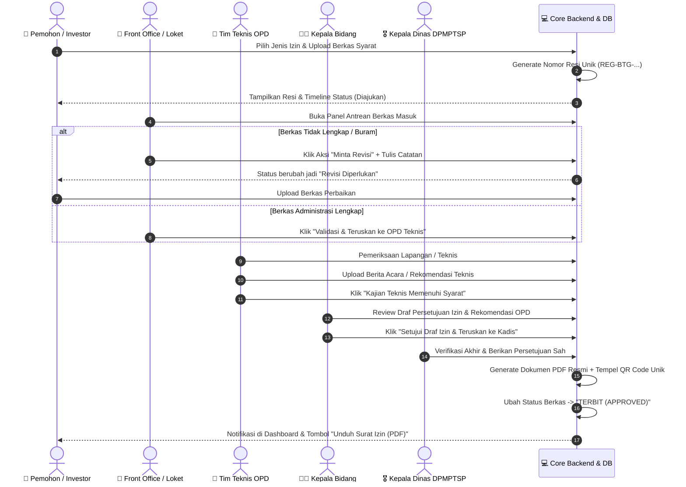

# 🏛️ DOKUMENTASI BACKEND (ARSITEKTUR & SISTEM)
## Sistem Informasi Perizinan, Non-Perizinan, dan Investasi
### Dinas Penanaman Modal dan Pelayanan Terpadu Satu Pintu (DPMPTSP) Kabupaten Bantaeng

---

## 📖 1. Pengantar untuk Programmer Pemula

Selamat datang di dokumentasi teknis backend! Jika Anda baru pertama kali melihat proyek Laravel skala instansi pemerintah, jangan khawatir. Dokumen ini dirancang dengan gaya bahasa yang ramah, analogis, dan sistematis.

### Apa itu Backend dalam Sistem DPMPTSP?
Bayangkan sebuah **Restoran Mewah**:
- **Frontend** adalah meja makan, buku menu yang indah, dan pelayan yang ramah menyapa pengunjung.
- **Backend** adalah **dapur di belakang layar**. Di sinilah bahan baku disimpan (Database), resep diolah secara higienis (Business Logic & Validasi), pesanan diteruskan antar-petugas (Alur Disposisi Izin), dan makanan resmi disajikan dengan stempel chef (Penerbitan Surat Izin PDF ber-QR Code).

Jika diibaratkan kantor fisik DPMPTSP Kabupaten Bantaeng:
- Pemohon datang membawa fotokopi berkas.
- Petugas Loket (Front Office) memeriksa kelengkapan map.
- Tim Teknis OPD (Dinas Kesehatan, Dinas PUPR, dll.) memeriksa syarat teknis di lapangan.
- Kepala Bidang (Kabid) memeriksa draf persetujuan.
- Kepala Dinas (Kadis) menandatangani surat izin resmi.

**Tugas utama Backend kita adalah mengubah seluruh birokrasi fisik di atas menjadi otomasi digital yang cepat, transparan, anti-suap, dan tervalidasi secara aman.**

---

## 🛠️ 2. Stack Teknologi Backend & Alasannya

| Komponen | Pilihan Teknologi | Kenapa Kita Memilih Ini? (Alasan untuk Pemula) |
| :--- | :--- | :--- |
| **Bahasa & Framework** | **PHP 8.3 & Laravel 11** | Laravel adalah framework PHP paling populer di dunia, khususnya di instansi pemerintahan Indonesia. Dokumentasinya sangat lengkap, komunitasnya luas, dan sangat mudah dirawat oleh programmer lokal di masa depan. |
| **Admin Engine** | **Filament PHP v3** | Membuat panel admin (tabel, tombol filter, form input, modal validasi) dari nol membutuhkan waktu berbulan-bulan. Filament v3 memberikan komponen backoffice siap pakai dengan tampilan modern berbasis Livewire 3 & Tailwind CSS. |
| **Basis Data** | **PostgreSQL 16** | Database relasional kelas enterprise yang sangat tangguh, mendukung tipe data JSONB (untuk form syarat dinamis) dan PostGIS/Geospasial untuk koordinat pemetaan Kawasan Industri Bantaeng (KIBA). |
| **Pembuat Dokumen PDF** | **Barryvdh DomPDF** | Mengubah template HTML/Blade menjadi dokumen PDF resmi berukuran A4 secara instan tanpa perlu menginstal browser Chromium di server. |
| **Segel Keaslian Dokumen** | **QR Code Generator** | Setiap izin yang terbit ditempelkan QR Code unik. Siapapun yang memindai (*scan*) QR tersebut menggunakan HP akan langsung diarahkan ke website resmi DPMPTSP Bantaeng untuk membuktikan bahwa dokumen tersebut asli dan bukan hasil rekayasa scanner/photoshop. |

---

## 📂 3. Struktur Direktori Backend (Peta Folder)

Berikut adalah panduan membaca folder proyek di `d:\dpmptsp`:

```text
dpmptsp/
├── app/
│   ├── Filament/               # [Backoffice Admin]
│   │   ├── Resources/          # CRUD & Halaman kelola perizinan, pengguna, & investasi
│   │   │   ├── ApplicationResource.php       # Halaman verifikasi berkas izin
│   │   │   ├── PermitTypeResource.php        # Halaman buat jenis izin & syarat dinamis
│   │   │   └── InvestmentResource.php        # Halaman input peta potensi investasi
│   │   ├── Widgets/            # Grafik & kartu statistik dashboard admin
│   │   └── Pages/              # Halaman kustom admin
│   ├── Http/
│   │   ├── Controllers/        # Pengendali alur data publik & pemohon
│   │   │   ├── PublicTrackingController.php  # Cek status izin via nomor resi
│   │   │   ├── DocumentVerifyController.php  # Verifikasi scan QR Code izin
│   │   │   ├── InvestmentMapController.php   # Data GeoJSON peta investasi
│   │   │   └── SecureFileStreamController.php# Pengirim file KTP/syarat berproteksi
│   │   └── Middleware/         # Satpam penyaring akses (Role, Session, Anti-tamper)
│   ├── Models/                 # Representasi tabel database (Eloquent ORM)
│   │   ├── User.php
│   │   ├── PermitCategory.php
│   │   ├── PermitType.php
│   │   ├── PermitRequirement.php
│   │   ├── Application.php
│   │   ├── ApplicationDocument.php
│   │   ├── ApplicationLog.php
│   │   ├── Investment.php
│   │   └── IssuedPermit.php
│   ├── Services/               # Otomasi logika bisnis rumit (Helper)
│   │   ├── ApplicationNumberService.php  # Generator nomor resi & SK otomatis
│   │   └── PdfGeneratorService.php       # Perakitan dokumen PDF & QR Code
│   └── Providers/
│       └── Filament/
│           └── AdminPanelProvider.php    # Konfigurasi tema, logo, menu panel admin
├── config/                     # Berkas setelan sistem (app, database, auth, filament)
├── database/
│   ├── migrations/             # Skrip cetak biru struktur tabel database
│   ├── seeders/                # Data sampel awal (Akun demo, Master Izin, Data Bantaeng)
│   └── factories/              # Pabrik data dummy untuk testing
├── routes/
│   ├── web.php                 # Jalur URL publik (Landing page, tracking, cetak PDF)
│   └── console.php             # Perintah cron job artisan
└── storage/
    ├── app/
    │   ├── private/            # 🔒 TEMPAT BERKAS RAHASIA PEMOHON (KTP, STR, SK)
    │   └── public/             # File publik (foto banner, logo, foto wisata)
```

---

## 🗄️ 4. Perancangan Basis Data (Database Schema)

PostgreSQL digunakan dengan pendekatan **Relasional Berintegritas Tinggi** dipadukan dengan **Kolom JSONB Dinamis**. Berikut adalah rincian setiap tabel:

### 1. Tabel `users` (Pengguna & Hak Akses)
Menyimpan seluruh data orang yang login ke dalam sistem, baik masyarakat maupun aparatur sipil negara (ASN) DPMPTSP Bantaeng.
- `id` (BigInteger, Primary Key)
- `name` (String): Nama lengkap pengguna beserta gelar jika ada.
- `email` (String, Unique): Alamat email resmi untuk notifikasi akun.
- `nik` (String, Nullable, Indexed): Nomor Induk Kependudukan (16 digit KTP) bagi pemohon warga.
- `phone` (String): Nomor kontak / WhatsApp aktif.
- `address` (Text, Nullable): Alamat domisili pemohon.
- `company_name` (String, Nullable): Nama PT/CV/Usaha jika pemohon adalah pelaku usaha.
- `nib` (String, Nullable): Nomor Induk Berusaha dari sistem OSS BKPM.
- `role` (Enum): Peran sistem:
  - `applicant`: Pemohon/Masyarakat/Investor.
  - `front_office`: Petugas Loket Penerimaan & Verifikasi Awal.
  - `technical_officer`: Tim Teknis OPD (Dinas Kesehatan, Dinas PUPR, Lingkungan Hidup, dll.).
  - `head_of_division`: Kepala Bidang (Kabid Pelayanan Perizinan).
  - `head_of_department`: Kepala Dinas DPMPTSP Bantaeng (Pejabat yang mengesahkan izin).
  - `superadmin`: Pengelola TI Dinas Kominfo / Administrator Utama Sistem.
- `password` (String): Hash kata sandi menggunakan enkripsi Bcrypt/Argon2.
- `is_active` (Boolean): Status aktif/blokir akun pengguna.
- `timestamps`: `created_at` & `updated_at`.

### 2. Tabel `permit_categories` (Kategori Perizinan)
Mengelompokkan puluhan jenis izin ke dalam rumpun sektor yang rapi di mata publik.
- `id` (BigInteger, Primary Key)
- `name` (String): Contoh: *"Sektor Kesehatan"*, *"Sektor Pembangunan & Tata Ruang"*, *"Sektor Penelitian & Pendidikan"*, *"Sektor Usaha & Reklame"*.
- `slug` (String, Unique): URL ramah SEO, misal: `sektor-kesehatan`.
- `icon` (String): Ikon pemanis tampilan (Heroicons / SVG).
- `description` (Text): Penjelasan singkat kategori izin.
- `is_active` (Boolean): Sakelar aktif/nonaktif kategori.

### 3. Tabel `permit_types` (Jenis Izin Dinamis)
Inti fleksibilitas sistem! Admin dapat membuat izin baru kapan saja tanpa perlu menyuruh programmer membuat tabel baru.
- `id` (BigInteger, Primary Key)
- `category_id` (Foreign Key -> `permit_categories.id`)
- `name` (String): Contoh: *"Surat Izin Praktik Dokter (SIP Dokter)"*, *"Izin Pemasangan Reklame"*, *"Izin Penelitian Mahasiswa/Akademisi"*.
- `code` (String, Unique): Kode unik izin, misal: `SIP-DOKTER`, `IZIN-REKLAME`.
- `sla_days` (Integer): Standar Operasional Prosedur (SOP) lama hari penyelesaian (misal: 3 hari kerja).
- `cost` (Decimal): Tarif retribusi resmi (Rp 0 jika gratis sesuai ketentuan pemda).
- `validity_period_months` (Integer): Masa berlaku surat izin (misal: 60 bulan / 5 tahun).
- `number_format_template` (String): Pola penomoran SK otomatis, misal: `{ROMAN_MONTH}/{YEAR}/DPMPTSP/SIP-DOKTER/{NUMBER}`.
- `technical_opd_name` (String): Nama OPD penanggung jawab kajian teknis (misal: *"Dinas Kesehatan Kabupaten Bantaeng"*).
- `is_active` (Boolean)

### 4. Tabel `permit_requirements` (Checklist Persyaratan Berkas)
Daftar dokumen fisik yang wajib/opsional diunggah oleh pemohon untuk jenis izin tertentu.
- `id` (BigInteger, Primary Key)
- `permit_type_id` (Foreign Key -> `permit_types.id` on delete cascade)
- `name` (String): Nama syarat, misal: *"Scan KTP Asli"*, *"Surat Tanda Registrasi (STR) yang Masih Berlaku"*, *"Surat Rekomendasi Organisasi Profesi (IDI/IBI/PPNI)"*, *"Surat Pernyataan Tempat Praktik"*.
- `file_type_allowed` (String): Format berkas (`pdf`, `jpg`, `png`).
- `max_file_size_kb` (Integer): Batas ukuran (misal: 2048 KB / 2 MB).
- `is_mandatory` (Boolean): Wajib atau Tambahan.
- `description` (Text, Nullable): Catatan penjelasan untuk pemohon agar tidak salah upload berkas.

### 5. Tabel `applications` (Permohonan Izin Pemohon)
Jantung transaksi perizinan! Menyimpan data permohonan yang diajukan oleh pemohon.
- `id` (BigInteger, Primary Key)
- `registration_number` (String, Unique, Indexed): Nomor Resi / Registrasi Acak Unik untuk publik tracking (Contoh: `REG-BTG-2026-09-0012`).
- `user_id` (Foreign Key -> `users.id`): Pemohon yang mengajukan.
- `permit_type_id` (Foreign Key -> `permit_types.id`)
- `status` (Enum):
  - `draft`: Pemohon baru mengisi sebagian dan belum disubmit.
  - `submitted`: Sudah dikirim oleh pemohon, menunggu antrean loket.
  - `verification_fo`: Sedang diperiksa kelengkapan administrasi oleh Front Office.
  - `verification_technical`: Berkas lengkap, sedang dikaji oleh Tim Teknis OPD terkait.
  - `approval_kabid`: Kajian teknis beres, menunggu persetujuan Kepala Bidang.
  - `approval_kadis`: Menunggu pengesahan & tanda tangan digital Kepala Dinas.
  - `approved`: **Selesai & Resmi Terbit!** Izin dapat diunduh pemohon.
  - `revision_required`: Berkas dikembalikan ke pemohon karena ada syarat yang buram/salah/kurang.
  - `rejected`: Ditolak secara definitif karena tidak memenuhi regulasi tata ruang/hukum.
- `revision_notes` (Text, Nullable): Catatan revisi yang dapat dibaca oleh pemohon jika status `revision_required`.
- `rejection_reason` (Text, Nullable): Alasan penolakan resmi.
- `applicant_data_snapshot` (JSONB): Salinan data pemohon saat permohonan dibuat (mencegah data historis berubah jika pemohon mengedit profil di kemudian hari).
- `submitted_at` (Timestamp, Nullable)
- `verified_fo_at` (Timestamp, Nullable)
- `verified_tech_at` (Timestamp, Nullable)
- `approved_kabid_at` (Timestamp, Nullable)
- `completed_at` (Timestamp, Nullable)

### 6. Tabel `application_documents` (Berkas Persyaratan yang Diunggah)
- `id` (BigInteger, Primary Key)
- `application_id` (Foreign Key -> `applications.id` on delete cascade)
- `permit_requirement_id` (Foreign Key -> `permit_requirements.id`)
- `file_path` (String): Lokasi path penyimpanan aman di disk server privat (misal: `private/documents/2026/09/app_12_ktp.pdf`).
- `original_filename` (String): Nama asli file saat diunggah pemohon.
- `file_size` (Integer): Ukuran file dalam bytes.
- `is_verified` (Boolean): Centang verifikasi dari petugas pemeriksa.
- `review_notes` (String, Nullable): Catatan jika berkas ini yang harus diperbaiki.

### 7. Tabel `application_logs` (Buku Jejak Digital / Audit Trail)
Transparansi 100%! Mencatat siapa melakukan apa, kapan, dan pesan apa yang ditinggalkan.
- `id` (BigInteger, Primary Key)
- `application_id` (Foreign Key -> `applications.id` on delete cascade)
- `user_id` (Foreign Key -> `users.id`): Petugas atau pemohon yang memicu aksi.
- `action` (String): Misal: *"Berkas Diajukan Pemohon"*, *"Verifikasi Administrasi Disetujui Loket"*, *"Disposisi ke Tim Teknis Dinkes"*, *"Rekomendasi Teknis Diterbitkan"*, *"Surat Izin Disahkan Kadis"*.
- `from_status` (String, Nullable)
- `to_status` (String)
- `notes` (Text, Nullable)
- `created_at` (Timestamp)

### 8. Tabel `issued_permits` (Surat Keputusan / Izin yang Telah Terbit)
- `id` (BigInteger, Primary Key)
- `application_id` (Foreign Key -> `applications.id`, Unique)
- `permit_number` (String, Unique, Indexed): Nomor SK Izin resmi Pemkab Bantaeng (misal: `503/042/DPMPTSP/SIP-D/IX/2026`).
- `issue_date` (Date): Tanggal terbit izin.
- `valid_until` (Date): Tanggal berakhirnya izin.
- `signed_by_name` (String): Nama Kepala Dinas saat menandatangani.
- `signed_by_nip` (String): NIP Kepala Dinas.
- `qr_verification_token` (String, Unique, Indexed): Kode acak unik 64 karakter (UUID/Hash) yang menjadi link validasi QR Code.
- `pdf_file_path` (String): Path berkas PDF izin final yang siap diunduh.

### 9. Tabel `investments` (Data Proyek & Potensi Investasi Bantaeng)
Data yang ditampilkan pada modul Peta Potensi Investasi (GIS):
- `id` (BigInteger, Primary Key)
- `title` (String): Contoh: *"Kawasan Industri Bantaeng (KIBA) Zona Smelter Nikel"*, *"Sentra Budidaya Rumput Laut Pa'jukukang"*, *"Pengolahan Kopi Dataran Tinggi Tompobulu"*, *"Kawasan Ekowisata Pantai Marina"*.
- `slug` (String, Unique)
- `sector` (Enum): `industri_manufaktur`, `kelautan_perikanan`, `pertanian_perkebunan`, `pariwisata`, `energi_terbarukan`, `jasa_perdagangan`.
- `district` (String): Nama Kecamatan di Bantaeng (Bantaeng, Bissappu, Eremerasa, Gantarangkeke, Pajukukang, Sinoa, Tompobulu, Uluere).
- `latitude` (Decimal, 10, 7): Titik lintang bumi (koordinat peta).
- `longitude` (Decimal, 10, 7): Titik bujur bumi (koordinat peta).
- `geojson_boundary` (JSONB, Nullable): Poligon batas wilayah kawasan (untuk menggambar area warna transparan di peta Leaflet).
- `area_size_hectares` (Decimal, Nullable): Luas lahan tersedia dalam satuan hektar.
- `estimated_investment_value` (BigInteger, Nullable): Estimasi nilai potensi investasi (Rupiah).
- `infrastructure_support` (JSONB): Fasilitas penunjang (List: Akses Jalan Nasional, Pasokan Listrik PLN, Pelabuhan Laut, Air Bersih PDAM, Jaringan Internet Fiber).
- `incentives_offered` (Text, Nullable): Insentif fiskal/non-fiskal daerah untuk calon investor.
- `contact_person_name` (String): Nama Petugas Desk Investasi DPMPTSP.
- `contact_person_phone` (String): Nomor kontak konsultasi penanaman modal.
- `thumbnail_image` (String, Nullable): Foto utama kawasan.
- `gallery_images` (JSONB, Nullable): Galeri dokumentasi lokasi potensi.
- `is_featured` (Boolean): Tampilkan di sorotan utama beranda.

---

## 🔄 5. Alur Bisnis Bertingkat (Multi-Role Workflow)



---

## 🛡️ 6. Keamanan Berkas & Perlindungan Data Pribadi (UU PDP)

### Masalah Klasik Web Biasa:
Banyak web pemula menyimpan foto KTP pemohon di folder `public/uploads/ktp/`. Akibatnya, siapa saja yang tahu atau menebak URL bisa membuka KTP orang lain tanpa login! Ini adalah pelanggaran privasi data berat.

### Solusi yang Diterapkan pada Backend Ini:
1. Seluruh berkas pemohon disimpan di folder **`storage/app/private/`** (tidak memiliki akses langsung dari browser web).
2. Dibuat sebuah Controller perantara khusus: **`SecureFileStreamController.php`**.
3. Ketika ada permintaan membuka berkas (misal: `/dokumen-pemohon/{id}/view`):
   - Controller memeriksa: *Apakah pengguna sedang login?*
   - Controller memeriksa: *Apakah pengguna adalah si pemilik berkas ATAU petugas resmi DPMPTSP yang berwenang?*
   - Jika **YA**: Berkas dialirkan (*stream*) aman ke browser.
   - Jika **TIDAK**: Sistem langsung menolak dengan kode HTTP **403 Forbidden**.

---

## 🖨️ 7. Dokumen PDF & QR Code Verification Engine

### 1. Bagaimana Surat Izin Dihasilkan?
- Saat Kepala Dinas menyetujui permohonan, sistem memanggil `PdfGeneratorService`.
- Sistem mengambil template Blade resmi Pemkab Bantaeng (`resources/views/pdf/permit_template.blade.php`), lengkap dengan:
  - Lambang Garuda / Logo Pemkab Bantaeng.
  - Kop Surat Resmi DPMPTSP Kabupaten Bantaeng.
  - Nomor SK Izin yang dibuat otomatis dari format counter bulanan.
  - Rincian izin, nama pemegang, NIK, alamat, dan batas masa berlaku.
  - Kotak Pengesahan Elektronik berisi QR Code.

### 2. Bagaimana QR Code Bekerja?
- Sistem membuat token acak unik (misal: `uuid-v4-89f4b-2a91...`).
- QR Code dikonfigurasi berisi link absolut:  
  `https://dpmptsp.bantaengkab.go.id/verifikasi-dokumen?token=uuid-v4-89f4b-2a91...`
- Ketika petugas kepolisian, dinas terkait, atau warga di lapangan memindai QR tersebut dengan kamera HP biasa, mereka akan membuka halaman portal resmi DPMPTSP Bantaeng.
- Halaman tersebut memvalidasi token dari database dan menampilkan centang hijau:
  > **DOKUMEN INI ASLI & TERDAFTAR RESMI**  
  > Nomor Izin: 503/042/DPMPTSP/SIP-D/IX/2026  
  > Pemegang: dr. Ahmad Fauzi, Sp.A  
  > Masa Berlaku: 15 September 2026 s/d 15 September 2031  
  > Diterbitkan oleh: Kepala DPMPTSP Kabupaten Bantaeng

Dengan mekanisme ini, pemalsuan dokumen izin di Kabupaten Bantaeng mustahil dilakukan tanpa terdeteksi!

---

## 🎯 8. Panduan Mengembangkan Fitur Baru Bagi Pemula

Jika di masa depan Anda ingin menambahkan fitur baru di backend:

1. **Membuat Tabel Baru**:  
   Gunakan perintah Artisan:  
   `php artisan make:migration create_nama_tabel_table`  
   Lalu definisikan kolom-kolomnya di file migrasi baru dalam `database/migrations/`.
2. **Membuat Model Eloquent**:  
   `php artisan make:model NamaModel`
3. **Membuat CRUD Admin di Panel Filament**:  
   Cukup jalankan:  
   `php artisan make:filament-resource NamaModel --generate`  
   Filament akan otomatis membuat form input dan tabel canggih dalam hitungan detik!
4. **Menjalankan Migrasi ke Database**:  
   `php artisan migrate`

---
*Dokumen ini disusun untuk memudahkan pemahaman arsitektur backend secara komprehensif tanpa ada bagian yang terlewat.*
