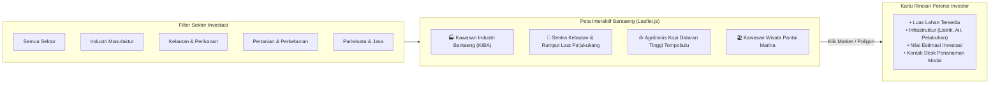

# 🎨 DOKUMENTASI FRONTEND (ANTARMUKA & PENGALAMAN PENGGUNA)
## Sistem Informasi Perizinan, Non-Perizinan, dan Investasi
### Dinas Penanaman Modal dan Pelayanan Terpadu Satu Pintu (DPMPTSP) Kabupaten Bantaeng

---

## 📖 1. Pengantar untuk Programmer Pemula

Selamat datang di dokumentasi antarmuka (*frontend*)! Jika backend adalah dapur dan mesin di balik layar, maka **Frontend adalah wajah dari DPMPTSP Kabupaten Bantaeng**. 

Masyarakat, calon investor dalam dan luar negeri, maupun aparatur dinas akan menilai kredibilitas, kemudahan, dan profesionalisme instansi pemerintah dari apa yang mereka lihat dan rasakan saat pertama kali membuka website ini.

### Pilar Teknologi Frontend yang Kita Gunakan:
1. **Laravel Blade Template**: Mesin cetak tampilan HTML milik Laravel. Bayangkan Blade seperti cetakan kue; kita cukup membuat satu cetakan bingkai luar (Header, Navigasi, Footer), lalu isi konten dalamnya bisa berganti-ganti dengan rapi tanpa mengetik ulang kode yang sama.
2. **Tailwind CSS v4**: Kakas penataan gaya visual modern berbasis *utility-first*. Alih-alih menulis ratusan baris file CSS manual yang membingungkan, kita cukup menyematkan nama kelas singkat pada elemen HTML (misal: `bg-emerald-600 text-white font-bold p-4 rounded-xl shadow-lg`).
3. **Livewire 3 & Alpine.js**: Memberikan keajaiban interaktivitas tanpa perlu beralih ke kerangka kerja rumit seperti React atau Vue yang membutuhkan build rumit. Formulir dapat divalidasi seketika, modal popup dapat dibuka-tutup secara mulus, dan data tabel dapat dicari tanpa *refresh* halaman secara penuh.
4. **Leaflet.js & OpenStreetMap**: Pustaka peta interaktif sumber terbuka yang sangat ringan untuk memvisualisasikan potensi investasi, titik lokasi industri, dan zonasi wilayah Kabupaten Bantaeng.

---

## 🏛️ 2. Panduan Identitas Visual & Warna Daerah (Branding Bantaeng)

Kabupaten Bantaeng dikenal dengan julukan bersejarah **Butta Toa** (Tanah Tertua). Karakter geografisnya sangat unik, membentang dari puncak pegunungan Lompobattang yang subur hingga pesisir pantai Selat Makassar yang strategis bagi kawasan industri laut.

Oleh karena itu, desain antarmuka mengadopsi palet warna resmi yang mencerminkan kewibawaan pemerintah daerah:

| Peran Warna | Kode Tailwind | Hex Code | Makna Filosofis Daerah |
| :--- | :--- | :--- | :--- |
| **Hijau Bantaeng (Primary)** | `emerald-700` | `#047857` | Melambangkan kesuburan pertanian sayur-mayur dan perkebunan kopi dataran tinggi Bantaeng (Tompobulu & Uluere), serta keramahan pelayanan publik. |
| **Biru Maritim (Secondary)** | `sky-700` | `#0369a1` | Melambangkan pesisir pantai, kawasan pelabuhan, sentra rumput laut, dan keterbukaan Bantaeng terhadap investasi industri modern (KIBA). |
| **Aksen Emas Butta Toa** | `amber-500` | `#f59e0b` | Melambangkan kemakmuran, martabat sejarah luhur daerah, dan keunggulan pelayanan prima. |
| **Latar Belakang Bersih** | `slate-50` | `#f8fafc` | Memberikan kesan modern, bersih, elegan, dan nyaman dibaca berlama-lama di layar komputer maupun HP. |
| **Tipografi Teks Utama** | `slate-800` | `#1e293b` | Kontras tinggi untuk keterbacaan dokumen hukum dan surat edaran resmi yang mudah dipahami warga lansia maupun pemuda. |

---

## 📱 3. Struktur & Komponen Halaman Publik (Landing Page)

Halaman depan (*landing page*) dirancang dengan pendekatan **Mobile-First** (optimal dibuka melalui smartphone warga) dan memiliki 8 blok komponen utama:

```text
[1. Topbar & Header Resmi Pemkab Bantaeng]
        │
[2. Hero Section + Slogan Pelayanan + Tombol Aksi Cepat]
        │
[3. Widget Cepat: Lacak Status Permohonan Izin (Cek Resi)]
        │
[4. Katalog Layanan Perizinan & Non-Perizinan Terpadu]
        │
[5. Modul Peta Interaktif GIS Potensi Investasi Daerah (Leaflet)]
        │
[6. Panduan Berusaha & Pendampingan OSS-RBA BKPM]
        │
[7. Berita, Maklumat Pelayanan, & Regulasi Daerah]
        │
[8. Footer Resmi, Kontak Pengaduan, & Peta Lokasi Kantor]
```

### Rincian Setiap Blok Komponen:

### 1. Topbar & Header Resmi
- **Elemen Kiri**: Logo Resmi Pemerintah Kabupaten Bantaeng bersanding dengan Logo DPMPTSP.
- **Teks Pendukung**: *"Dinas Penanaman Modal dan Pelayanan Terpadu Satu Pintu Kabupaten Bantaeng - Melayani dengan Cepat, Pasti, Transparan, dan Tanpa Pungli"*.
- **Elemen Kanan**:
  - Jam Layanan Loket: *"Senin - Jumat: 08.00 - 15.30 WITA"*.
  - Tautan Cepat: Beranda, Layanan Izin, Peta Investasi, Lacak Berkas, Pengaduan.
  - Tombol *"Masuk / Daftar Akun Pemohon"* (menuju Citizen Portal).

### 2. Hero Section (Sorotan Utama)
- **Visual Background**: Foto beresolusi tinggi panorama Kabupaten Bantaeng (perpaduan keindahan Pantai Marina dan dinamika Kawasan Industri Bantaeng / KIBA) dengan lapisan gradien gelap elegan agar teks terbaca jelas.
- **Teks Headline**: *"Satu Portal Terpadu untuk Kemudahan Perizinan dan Peluang Investasi di Kabupaten Bantaeng"*.
- **Sub-headline**: *"Urus perizinan berusaha dan non-berusaha dari rumah. Transparan, kepastian waktu, dan keabsahan dokumen berstandar tanda tangan elektronik."*
- **Dua Tombol Aksi Utama (Call to Action)**:
  1. Tombol `[+ Ajukan Permohonan Izin Baru]` -> Mengarahkan warga ke formulir pendaftaran izin.
  2. Tombol `[🔍 Lacak Berkas Izin]` -> Menggulirkan layar langsung ke widget pelacakan resi.

### 3. Widget Cepat: Lacak Status Permohonan Izin Mandiri (Cek Resi)
Komponen favorit masyarakat! Warga tidak perlu repot-repot datang ke kantor dinas hanya untuk menanyakan: *"Pak/Bu, berkas saya sudah sampai di mana?"*.
- **Antarmuka**: Satu kolom pencarian besar dengan ikon kaca pembesar.
  - Teks Placeholder: *"Masukkan Nomor Registrasi / Resi Anda (Contoh: REG-BTG-2026-09-0012)..."*
  - Tombol: *"Cari Status Berkas"*.
- **Respon Interaktif (Tanpa Reload)**:
  Saat nomor resi ditemukan, muncul kartu riwayat dengan **Timeline Berwarna**:
  - `🟢 1. Berkas Diterima Sistem` (Lengkap dengan tanggal dan jam).
  - `🟢 2. Verifikasi Administrasi oleh Loket` (Status: Lengkap & Sah).
  - `🔵 3. Kajian Teknis Lapangan oleh OPD Terkait` (Status: Sedang Berjalan).
  - `⚪ 4. Persetujuan Kepala Bidang` (Menunggu).
  - `⚪ 5. Pengesahan Kepala Dinas & Penerbitan Dokumen` (Menunggu).

### 4. Katalog Layanan Perizinan & Non-Perizinan
Katalog terstruktur yang membagi layanan izin menjadi kartu-kartu interaktif:
- **Kategori Layanan**:
  - 🩺 **Sektor Kesehatan**: Surat Izin Praktik (SIP) Dokter Umum, Dokter Spesialis, Bidan, Perawat, dan Tenaga Farmasi.
  - 🏗️ **Sektor Pembangunan & Tata Ruang**: Izin Pemasangan Reklame, Rekomendasi Kesesuaian Tata Ruang Daerah.
  - 🎓 **Sektor Sosial, Pendidikan & Riset**: Izin Penelitian Mahasiswa/Akademisi, Izin Operasional Lembaga Kursus/PAUD.
  - 💼 **Sektor Penanaman Modal & Usaha**: Fasilitasi Konsultasi OSS-RBA, Pendampingan Laporan Kegiatan Penanaman Modal (LKPM).
- **Fitur pada Setiap Kartu**:
  - Nama Izin & Standar Waktu Penyelesaian (SLA, misal: *3 Hari Kerja*).
  - Biaya Retribusi (*Rp 0 / Gratis* atau sesuai Perda).
  - Tombol *"Lihat Syarat Berkas"* (Membuka popup modal berisi daftar checklist berkas yang wajib disiapkan pemohon).
  - Tombol *"Mulai Ajukan"*.

---

## 🗺️ 4. Modul Peta Interaktif Potensi Investasi (GIS Web Map)

Modul ini dirancang khusus untuk memikat calon investor domestik maupun mancanegara yang ingin menanamkan modal di Kabupaten Bantaeng.



### Spesifikasi Teknis Pemetaan:
1. **Pusat Peta Default (Center of Map)**:
   - Koordinat Kabupaten Bantaeng: `Latitude: -5.5489`, `Longitude: 119.9538`.
   - Level Pembesaran Awal (*Zoom Level*): `11`.
2. **Lapisan Poligon Wilayah (GeoJSON Overlays)**:
   - **Kawasan Industri Bantaeng (KIBA)**: Diberi batas poligon berwarna merah transparan (`#ef4444` dengan transparansi 30%) yang mencakup wilayah industri di Kecamatan Pa'jukukang.
   - **Kawasan Agropolitan Uluere & Tompobulu**: Diberi batas poligon hijau (`#10b981`).
3. **Penanda Pin Khusus (Custom Markers)**:
   - Ikon Pabrik/Industri untuk Smelter dan Pabrik Pengolahan.
   - Ikon Jangkar/Kapal untuk Pelabuhan Mattoanging dan sentra perikanan.
   - Ikon Daun/Kopi untuk potensi agrobisnis.
   - Ikon Pohon Kelapa/Pantai untuk potensi pariwisata.
4. **Interaktivitas Saat Marker Diklik (Popup / Drawer Modal)**:
   - Menampilkan nama proyek investasi.
   - Galeri foto dokumentasi lapangan kawasan.
   - Tabel fasilitas penunjang: Ketersediaan Daya Listrik (PLN), Akses Air Bersih (PDAM/Sungai Calendu), Kedekatan dengan Jalur Trans Sulawesi dan Pelabuhan.
   - Estimasi Nilai Investasi (Rupiah).
   - Tombol *"Hubungi Fasilitator Investasi / Desk DPMPTSP Bantaeng"*.

---

## 👤 5. Portal Pemohon (Citizen & Investor Portal Area)

Setelah pemohon mendaftarkan akun menggunakan NIK KTP atau NIB Usaha, pemohon akan masuk ke dashboard khusus yang aman dan bersih:

### 1. Wizard Pengajuan Izin Bertahap (Multi-Step Form)
Mencegah pemohon merasa lelah atau bingung dengan formulir yang terlalu panjang:
- **Langkah 1: Pilih Layanan Izin**  
  Pemohon memilih jenis izin dari dropdown/kartu pilihan.
- **Langkah 2: Data Pemohon & Objek Izin**  
  Data pribadi otomatis terisi dari profil akun; pemohon melengkapi lokasi objek izin (misal: alamat klinik praktik dokter atau titik lokasi reklame).
- **Langkah 3: Unggah Berkas Persyaratan (Dinamis)**  
  Sistem secara otomatis menampilkan kotak upload sesuai persyaratan yang ditentukan oleh admin di backend.
  - Setiap kotak berkas memiliki validasi langsung (misal: *"Hanya file PDF, maksimal 2 MB"*).
  - Terdapat indikator progress bar saat proses upload sedang berlangsung.
- **Langkah 4: Pratinjau & Pernyataan Kebenaran Data**  
  Pemohon melihat ringkasan seluruh isian dan berkas, mencentang klausul pakta integritas bahwa data yang dikirimkan adalah benar, lalu menekan tombol `[Kirim Permohonan]`.

### 2. Dashboard Riwayat Permohonan
- Menampilkan daftar seluruh permohonan yang pernah diajukan.
- Dilengkapi **Badge Status Berwarna**:
  - `Kuning`: Menunggu Verifikasi Loket / Menunggu Disposisi.
  - `Biru`: Sedang Dalam Kajian Teknis OPD.
  - `Oranye`: Perlu Revisi Berkas (Ada tombol untuk melihat catatan petugas dan mengunggah ulang dokumen yang salah).
  - `Hijau`: Izin Telah Terbit & Sah.
- **Tombol Unduh Surat Izin (PDF)**:
  Tombol ini hanya akan aktif jika status permohonan sudah `approved`. Begitu ditekan, dokumen izin resmi ber-QR Code langsung terunduh ke perangkat pengguna.

---

## 🔍 6. Halaman Publik Verifikasi Keaslian Dokumen (Scan QR Code)

Halaman ini terbuka untuk siapa saja di seluruh dunia yang memindai QR Code pada lembar dokumen izin fisik maupun file PDF:

### Skenario 1: Dokumen Asli & Masih Berlaku
- Menampilkan lambang resmi Pemkab Bantaeng dengan lencana hijau bertuliskan:
  **"DOKUMEN INI RESMI, SAH, DAN TERCATAT PADA DATABASE DPMPTSP KABUPATEN BANTAENG"**.
- Menampilkan data publik esensial:
  - Nomor Izin: `503/042/DPMPTSP/SIP-D/IX/2026`
  - Jenis Izin: *Surat Izin Praktik Dokter (SIP Dokter)*
  - Nama Pemegang Izin: *dr. Rahmat Hidayat, Sp.PD*
  - Lokasi Praktik / Objek: *Klinik Sehat Bantaeng, Jl. Kartini No. 12, Bantaeng*
  - Tanggal Ditetapkan: *15 September 2026*
  - Masa Berlaku Hingga: *15 September 2031*
  - Pejabat Penandatangan: *Kepala DPMPTSP Kabupaten Bantaeng*

### Skenario 2: Token Tidak Ditemukan / Dokumen Palsu
- Menampilkan kartu peringatan merah bertuliskan:
  **"DOKUMEN TIDAK TERDAFTAR ATAU TOKEN TIDAK VALID"**.
- Imbauan untuk melaporkan indikasi pemalsuan dokumen ke hotline pengaduan resmi DPMPTSP Bantaeng.

---

## 📐 7. Standar Struktur Berkas Tampilan (Blade Views)

Berikut adalah struktur susunan file template pada folder `resources/views/`:

```text
resources/views/
├── layouts/
│   ├── app.blade.php           # Template utama publik (Header, Nav, Footer)
│   ├── portal.blade.php        # Template dashboard pemohon
│   └── guest.blade.php         # Template halaman login / register
├── components/                 # Komponen kecil yang dapat dipakai berulang kali
│   ├── navbar.blade.php        # Bilah menu navigasi
│   ├── footer.blade.php        # Kaki halaman resmi
│   ├── status-badge.blade.php  # Pemanis status izin (warna dinamis)
│   └── modal.blade.php         # Kerangka kotak dialog popup
├── pages/
│   ├── home.blade.php          # Beranda utama publik
│   ├── tracking.blade.php      # Halaman lacak nomor resi
│   ├── services/
│   │   ├── index.blade.php     # Katalog seluruh izin
│   │   └── show.blade.php      # Detail syarat per izin
│   ├── investments/
│   │   ├── index.blade.php     # Peta GIS & daftar potensi investasi
│   │   └── show.blade.php      # Detail satu proyek investasi
│   └── verify-document.blade.php # Halaman hasil pemindaian QR Code
├── portal/                     # Halaman khusus pemohon terdaftar
│   ├── dashboard.blade.php     # Ringkasan permohonan saya
│   ├── apply.blade.php         # Formulir pendaftaran izin bertahap
│   └── show-application.blade.php # Detail progres & perbaikan berkas
└── pdf/
    └── permit_document.blade.php # Template tata letak dokumen cetak A4 PDF
```

---
*Dokumen ini menyajikan seluruh arsitektur antarmuka pengguna secara mendalam dan terpadu untuk kemudahan implementasi tim pengembang.*
