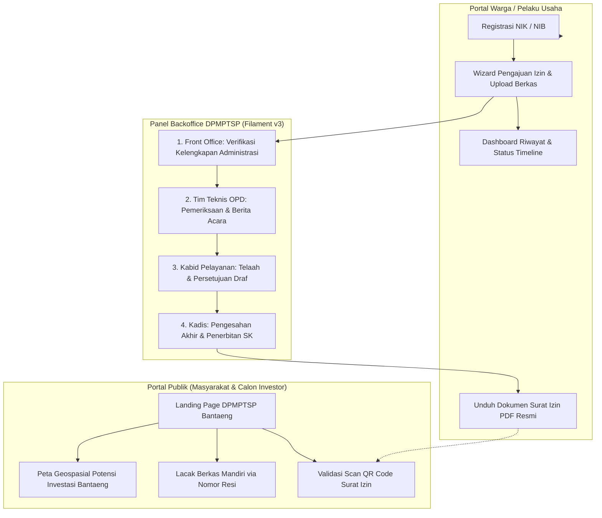

# 🏛️ Portal Informasi Perizinan, Non-Perizinan, dan Investasi Terpadu
## Dinas Penanaman Modal dan Pelayanan Terpadu Satu Pintu (DPMPTSP) Kabupaten Bantaeng

<p align="center">
  
  <br>
  <strong>Pemerintah Kabupaten Bantaeng, Provinsi Sulawesi Selatan</strong>
  <br>
  <em>"Melayani dengan Cepat, Pasti, Transparan, Akuntabel, dan Bebas Pungli"</em>
</p>

<p align="center">
  <a href="https://laravel.com"></a>
  <a href="https://filamentphp.com"></a>
  <a href="https://tailwindcss.com"></a>
  <a href="https://www.postgresql.org"></a>
  <a href="https://leafletjs.com"></a>
</p>

---

## 📌 1. Latar Belakang & Ruang Lingkup

Kabupaten Bantaeng merupakan salah satu pusat pertumbuhan ekonomi terdepan di Sulawesi Selatan, didukung oleh dinamika **Kawasan Industri Bantaeng (KIBA)**, keunggulan maritim perikanan dan rumput laut, serta potensi agribisnis dataran tinggi yang subur.

Aplikasi ini dibangun untuk menyatukan tiga pilar pelayanan publik daerah ke dalam **Satu Portal Digital Terpadu**:
1. **Landing Page Publik & Informasi Penanaman Modal**: Menyajikan profil dinas, berita/pengumuman, regulasi daerah, serta promosi potensi investasi Kabupaten Bantaeng berbasis peta spasial interaktif.
2. **Sistem Otomasi Perizinan & Non-Perizinan End-to-End**: Melayani pengajuan izin daerah (seperti SIP Tenaga Medis, Izin Reklame, Izin Penelitian, dsb.) mulai dari pendaftaran online, unggah berkas, verifikasi bertingkat (*Front Office -> Tim Teknis OPD -> Kabid -> Kadis*), hingga penerbitan surat izin resmi.
3. **Legalitas & Validasi Keaslian Dokumen Terbuka**: Setiap dokumen izin yang terbit dilengkapi segel elektronik dan **QR Code Verifikasi Unik** yang dapat dipindai langsung oleh aparat maupun masyarakat untuk membuktikan keaslian izin secara seketika.

---

## 📚 2. Indeks Dokumentasi Terperinci (Wajib Dibaca)

Untuk mempermudah pemahaman arsitektur dan tata kelola sistem, dokumentasi telah dipisahkan ke dalam berkas-berkas mendalam dengan bahasa yang ramah bagi pemula:

| Berkas Panduan | Fokus Pembahasan | Isi Dokumen |
| :--- | :--- | :--- |
| 📖 **[BACKEND.md](BACKEND.md)** | **Arsitektur & Mesin Sistem** | Penjelasan struktur folder Laravel 11, perancangan skema database PostgreSQL 16 lengkap, alur disposisi bertingkat (*multi-role approval*), sistem form izin dinamis, keamanan berkas privat pemohon (UU PDP), dan generator PDF ber-QR Code. |
| 🎨 **[FRONTEND.md](FRONTEND.md)** | **Antarmuka & Pengalaman Pengguna (UI/UX)** | Penjelasan konsep Blade, Tailwind CSS v4, Livewire 3, dan Alpine.js; anatomi 8 blok komponen Landing Page; spesifikasi modul Peta Interaktif Potensi Investasi (Leaflet.js); wizard pendaftaran izin bertahap; dan panduan palet warna identitas Bantaeng (*Butta Toa*). |
| 🤝 **[contrib.md](contrib.md)** | **Panduan Inisiasi Lokal & Kontribusi** | Panduan ramah pemula langkah-demi-langkah (*Zero-to-Hero*) untuk menjalankan proyek di laptop/komputer lokal (Windows, Linux, macOS), instalasi PHP 8.3 & Composer, konfigurasi `.env`, migrasi database, daftar akun percobaan demo, dan pemecahan masalah (*troubleshooting*). |

---

## 🏗️ 3. Arsitektur Alur Sistem Terpadu



---

## ⚡ 4. Panduan Kilat Menjalankan Proyek (Quick Start)

Bagi pengembang yang ingin menyalakan aplikasi di komputer lokal:

```bash
# 1. Kloning repositori
git clone https://github.com/HaikalAkbar13/dpmptsp.git
cd dpmptsp

# 2. Salin konfigurasi environment
cp .env.example .env

# 3. Pasang dependensi Backend dan Frontend
composer install
npm install

# 4. Generate Application Key & Jalankan Migrasi
php artisan key:generate
php artisan migrate --seed
php artisan storage:link

# 5. Jalankan server lokal
php artisan serve
# Di terminal terpisah:
npm run dev
```

Akses sistem di peramban Anda:
- **Halaman Publik**: `http://localhost:8000`
- **Panel Petugas / Admin**: `http://localhost:8000/admin`
- **Portal Pemohon Warga**: `http://localhost:8000/portal`

*(Rincian lengkap kredensial akun uji coba dapat dilihat pada file [contrib.md](contrib.md)).*

---

## 🔒 5. Kepatuhan Keamanan & Perlindungan Data Pribadi (UU PDP)

Sistem ini mematuhi amanat **Undang-Undang Nomor 27 Tahun 2022 tentang Pelindungan Data Pribadi (UU PDP)**:
- **Penyimpanan Berkas Terenkripsi/Terkunci**: Dokumen sensitif warga (KTP, STR dokter, sertifikat tanah, NPWP) tidak disimpan di folder yang dapat diakses publik, melainkan diisolasi di direktori privat server (`storage/app/private/`).
- **Akses Berbasis Hak Wewenang**: Berkas hanya dapat dialirkan (*streamed*) ke browser apabila pengguna yang meminta adalah pemilik berkas atau petugas verifikator resmi yang berwenang.
- **Audit Trail Digital**: Setiap perpindahan status berkas, disposisi petugas, dan catatan verifikasi dicatat secara permanen pada log aktivitas sistem (*tamper-evident*).

---

## 🏛️ 6. Informasi & Kontak Resmi Dinas

**Dinas Penanaman Modal dan Pelayanan Terpadu Satu Pintu Kabupaten Bantaeng**  
📍 Jl. Andi Mannappiang No. 5, Lembang, Kec. Bantaeng, Kabupaten Bantaeng, Sulawesi Selatan 92411  
🌐 Website Resmi Pemkab: [bantaengkab.go.id](https://bantaengkab.go.id)  
⏰ Jam Operasional Loket: Senin - Jumat, 08.00 - 15.30 WITA

---
*Dikelola oleh Tim Pengembang Sistem Informasi DPMPTSP Kabupaten Bantaeng. Hak Cipta Dilindungi Undang-Undang.*
